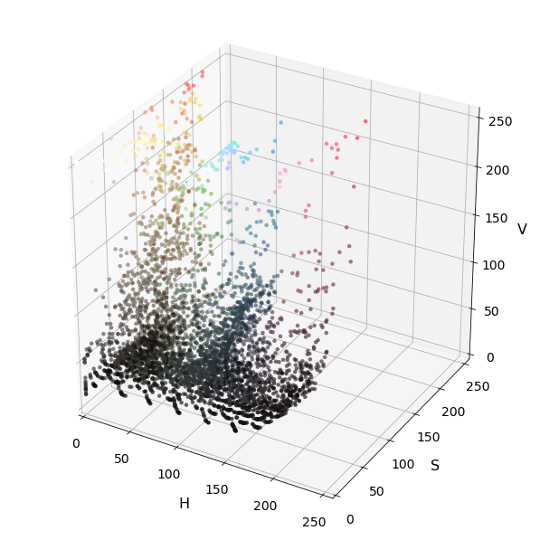
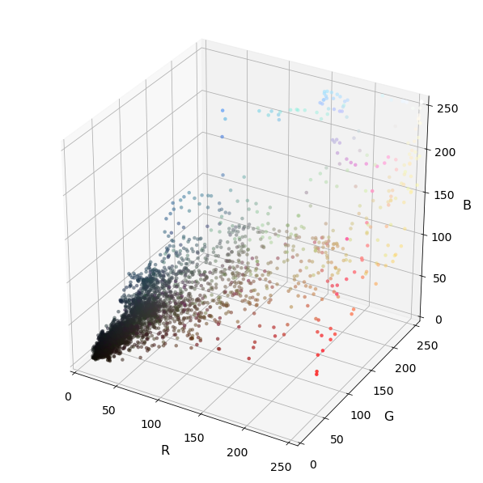
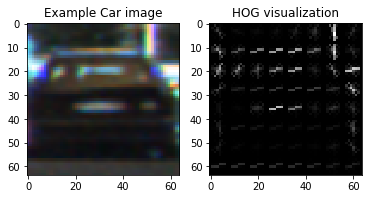
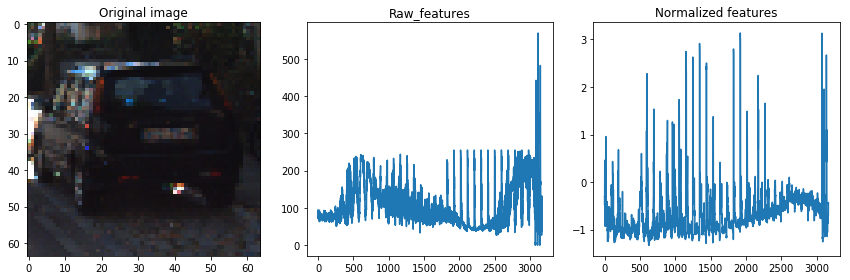
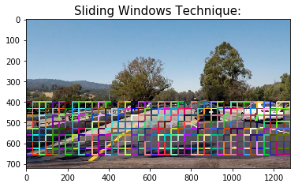
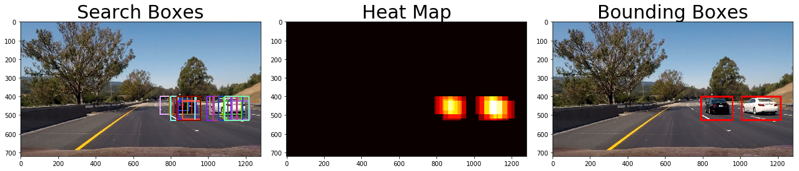

# Vehicle Detection and Tracking

The goal of this project is detecting cars in the road

    

With that aim I have followed the next steps:

* Read and shuffle car and not car images for training my classifier. 

* Extract the features from the images so we can classify them.

* Perform a Histogram of Oriented Gradients (HOG) feature extraction on a labeled training set of images and train a classifier Linear SVM classifier.

* With a Sliding Window method, search for vehicles in a set of images.

* Estimate with a bounding box where the cars are in a video.

## Files contained

* `Pipeline.ipynb` : Basic code for this project 

* `data` : contains a link to the `vehicles` and `non-vehicles` datasets

* `output_images` : Explain images

* `test_images` : Images used as experiments

* `test_videos` : Videos provided by Udacity

* `README.md` : What you are reading right now

##Getting all the data

For training my classifier I have taken the advantage from the dataset provided by Udacity. I have divided the images in two big groups: **`vehicle`** which I have called `cars` and **`non-vehicle`** named `noncars`

## 3D Color Space

You can study the distribution of color values in an image by plotting each pixel in some color space.

HSV model:

    

RGB model:

    

## HOG features

I have defined a function called **`get_hog_features`** that takes in an image and compute the HOG characteristics.

This function contains a flag that is activated depending on if you want to get the HOG image or just the characteristics. 

The parameters that I input to the function are: img, orientations, pixels_per_cell, cells_per_block, trasnform_sqrt, visualise, feature_vector.

I'm using the **`hog()`** function from the [scikit-image](http://scikit-image.org/docs/dev/api/skimage.feature.html?highlight=feature%20hog#skimage.feature.hog) package.

    

## Histograms of colors

With the **`color_hist`** function I get the color features for later processing. Here you can spot an example.

    

## Spatial Binning of Color

While it could be cumbersome to include three color channels of a full resolution image, you can perform spatial binning on an image and still retain enough information to help in finding vehicles.

The **`bin_spatial`** function takes in an image, a color space, and a new image size and returns a feature vector.

    

## Extract some features from a list of images

The funciton **`extract_features2`** uses the functions that have been already described **`bin_spatial`**, **`color_hist`** and **`get_hog_features`**. 

## Sliding Window implementation

I set start and stop positions in x and y.The windows size and the overlap fractions are both required parameters (both in x and y dimensions).The function is called **`slide_window`**.

    

## Extract single image features

I use a function called **`single_img_features`** that extracts HOG and color features from a list of images. Then I pass the features extracted to the 'search window' which searchs which windows fit for comparing it with the classifier. 

## Detecting the cars filtering the boxes with Heatmaps
 
We need to detect how many pixels are per box so we find the "hottest" points. With **`add_heat`** function we sum up all the pixels in the same point so the color gets stronger.
As sometimes there are some false positives, there is another function that sets how many boxes are required to count those pixels as "hot", its name is **`apply_threshold`**. 

Finally we need to label the results, **`draw_labeled_bboxes`** function take the hot pixels and labels the positions where the cars are spotted. 

    

## Creating a Video using the Pipeline

Now we need to pass through the pipeline a video instead of single images. We use **`clip.fl_image(process_image)`** and select where to save the video.

## Conclusions

1. This pipeline struggles with the appeareance of shadows (as in the previous project) what leads to the creation of false positives. I think adding darker images to both: car and noncars, will help the process.

2. This method of image recognition is not good for being used in vehicle detection because it takes so much time for processing. I think deep learning is proper for this scenario.

